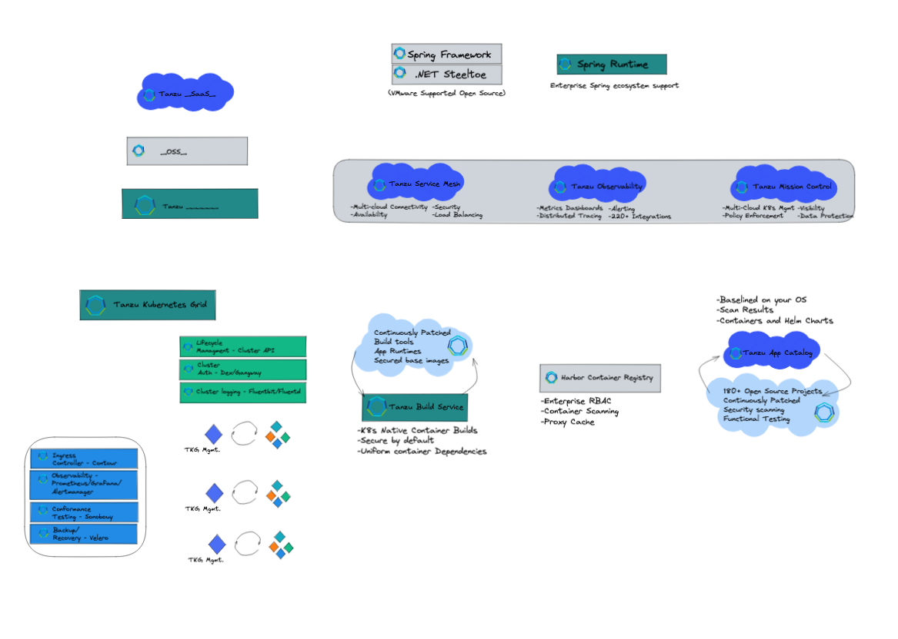

# Tanzu Excalidraw

A segmented list of Tanzu relevant excalidraw libraries. Allows for dynamically generating a list of the appropriate icons for your context!

```bash
python3 create_lib.py core users
```

Load `lib.excalidrawlib` into your excalidraw and rock on!

Alternatively, you can individually upload the libraries from the `raw` directory, 1 by 1

## References
1. [Included libraries](#included-libraries)
2. [Bonus!](#bonus)

## Included libraries
- core: The base product icons with some core use case examples
- users: Generic user icons (People, person, operators, devs, etc.)
- 5s: [5s 'Built to Adapt' benchmark](https://tanzu.vmware.com/content/announcements/the-built-to-adapt-benchmark-will-help-companies-to-set-a-new-course) iconography.
- service: Icons for services/external products (GitHub, Redis, Docker, etc.)
- generic: Computers, servers, applications, etc.

## Examples
### core

### users

### 5s

### service

### generic


## Bonus!
There is a starter excalidraw provided here that can be used as an initial whiteboard template